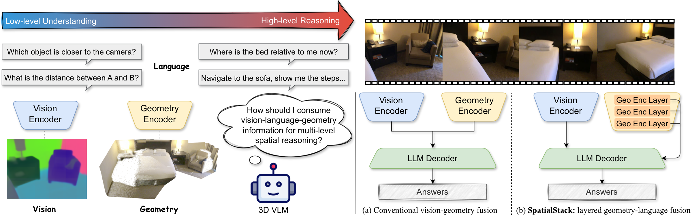

<div align="center">

# SpatialStack: Layered Geometry-Language Fusion for 3D VLM Spatial Reasoning (CVPR 2026)

<a href="https://jzh15.github.io/">Jian Zhang</a><sup>1</sup><sup>&ast;</sup>, <a href="https://shijiezhou-ucla.github.io/">Shijie Zhou</a><sup>2</sup><sup>&ast;</sup>, <a href="https://pages.cs.wisc.edu/~bangya/">Bangya Liu</a><sup>3</sup><sup>&ast;</sup>, <a href="https://visual.ee.ucla.edu/">Achuta Kadambi</a><sup>2</sup>, <a href="https://zhiwenfan.github.io/">Zhiwen Fan</a><sup>1</sup>

<sup>1</sup> Texas A&M University, <sup>2</sup> University of California, Los Angeles, <sup>3</sup> University of Wisconsin-Madison  
<sup>&ast;</sup> Equal contribution.

</div>

<p align="center">
  <a href="https://arxiv.org/abs/2603.27437"></a> &nbsp;&nbsp;&nbsp;&nbsp;
  <a href="https://spatial-stack.github.io/"></a> &nbsp;&nbsp;&nbsp;&nbsp;
  <a href="https://huggingface.co/Journey9ni/SpatialStack-Qwen2.5-4B"></a> &nbsp;&nbsp;&nbsp;&nbsp;
  <a href="https://huggingface.co/datasets/Journey9ni/SpatialStackData"></a> &nbsp;&nbsp;&nbsp;&nbsp;
  <a href="https://github.com/phai-lab/SpatialStack/blob/main/LICENSE"></a>
</p>

## Overview



SpatialStack progressively aligns vision, geometry, and language representations across model layers, moving beyond single-stage late fusion and improving both local geometric precision and global spatial semantics.

## 📰 News

- 2026-02-21: Our paper has been accepted to CVPR 2026. See you in Denver!

## 📝 TODO List

- [x] Support training, inference, and evaluation based on Qwen3.5.

## Key Contributions

- **Systematic Analysis of Fusion Layers.** We provide a layer-wise analysis of fusion across the vision encoder, geometry encoder, and LLM decoder, and reveal a hierarchical geometry-language correspondence: shallow layers capture fine spatial details, while deeper layers encode global structure and context.
- **SpatialStack Framework.** We propose SpatialStack, a hierarchical fusion design that progressively aligns multi-level geometric and language features, moving beyond single-stage late fusion and enabling joint local-global spatial reasoning.
- **VLM-SpatialStack Realization.** We build VLM-SpatialStack as a concrete geometry-aware multimodal LLM realization, and extensive benchmark and ablation results show state-of-the-art performance with strong generalization on diverse 3D spatial reasoning tasks.

## Model Architecture


This diagram shows how SpatialStack pairs a standard VLM backbone with a multi-view geometry branch, then injects geometry features into the decoder progressively through layer-specific projectors. The multi-level fusion preserves both fine geometric detail and global spatial context, improving reliability for low-level perception and high-level spatial reasoning.

## ⚙️ Setup

Use Python 3.10. Build a clean environment and install the project:
Run all commands below from the repository root.

```bash
conda create -n spatialstack python=3.10 -y
conda activate spatialstack

# install PyTorch first
# GPU (CUDA 12.4):
pip install torch torchvision torchaudio --index-url https://download.pytorch.org/whl/cu124

# then install this repo
pip install -e .
```

Optional acceleration dependencies for Qwen3.5 training:

```bash
# Speeds up the Qwen3.5 linear-attention path substantially.
pip install flash-linear-attention

# Optional. Qwen3.5 can run without it, but some upstream fast paths check for it.
# Build support depends on your local CUDA / torch toolchain.
pip install causal-conv1d --no-build-isolation
```

Quick check:

```bash
python -c "import torch, transformers; print(torch.__version__, transformers.__version__)"
```

Recommended Qwen3.5 checks:

```bash
python -c "import torch, transformers, fla; print(torch.__version__, transformers.__version__)"
```

Notes:

- Qwen3.5 training in this repo is validated with `transformers==5.2.0`.
- Keep `ATTN_IMPLEMENTATION=sdpa` for Qwen3.5 unless you have independently verified `flash_attention_2` on your stack.
- On our tested Blackwell stack, installing `flash-linear-attention` improved Qwen3.5 step time from about `1.29s` to `0.42s` and reduced peak memory from about `57.7 GB` to `41.2 GB`.
- `flash_attention_2` was still unstable on that stack even after installing `flash-linear-attention`.

## 🤖 Inference

Download weights:

```bash
hf download Journey9ni/SpatialStack-Qwen2.5-4B \
  --repo-type model \
  --local-dir checkpoints/SpatialStack-Qwen2.5-4B
```

Run inference with local weights:

```bash
python scripts/inference/infer.py \
  --model-path checkpoints/SpatialStack-Qwen2.5-4B \
  --image assets/sofas.jpg \
  --prompt "Describe the spatial relation between the sofa and the table."
```

Run inference with a Qwen3.5 checkpoint:

```bash
python scripts/inference/infer.py \
  --model-path Qwen/Qwen3.5-4B \
  --model-family qwen3_5 \
  --image assets/sofas.jpg \
  --prompt "Describe the spatial relation between the sofa and the table."
```

## 📈 Evaluation

Evaluation command (script + optional parameters):

```bash
MODEL_PATH=Journey9ni/SpatialStack-Qwen2.5-4B \
OUTPUT_ROOT=logs/eval/spatialstack_qwen25_4b \
BENCHMARKS="vsibench" \
bash scripts/evaluation/eval.sh
```

Qwen3.5 evaluation uses the same entrypoint:

```bash
MODEL_PATH=Qwen/Qwen3.5-4B \
MODEL_FAMILY=qwen3_5 \
OUTPUT_ROOT=logs/eval/spatialstack_qwen35_4b \
BENCHMARKS="vsibench" \
bash scripts/evaluation/eval.sh
```

Optional parameters:

- `MODEL_PATH`: HF model id or local checkpoint path.
- `MODEL_FAMILY`: backend family override. choices: `auto,qwen2_vl,qwen2_5,qwen3_5`
- `OUTPUT_ROOT`: Root directory for evaluation outputs.
- `BENCHMARKS`: Comma-separated benchmarks.
  choices: `vsibench,cvbench,blink_spatial,sparbench,videomme,mmsibench`
- `BENCHMARK`: Single benchmark (used when `BENCHMARKS` is not set).
- `CUDA_VISIBLE_DEVICES`: Select visible GPU ids.
- `NUM_MACHINES`, `PROCESSES_PER_MACHINE`, `MACHINE_RANK`: Override distributed launch settings.
- `MASTER_ADDR`, `MASTER_PORT`: Multi-node rendezvous settings.

Outputs:

- Aggregated metrics: `*_results.json`
- Per-sample logs: `*_samples_<task>.jsonl`

## 🚀 Training

See [TRAINING.md](./TRAINING.md) for the full training workflow,
including data preparation and launch settings.

## 🙏 Acknowledgements

Thanks to the following open-source projects:

- [VLM-3R](https://github.com/VITA-Group/VLM-3R)
- [VG-LLM](https://github.com/LaVi-Lab/VG-LLM)
- [SPAR](https://github.com/LogosRoboticsGroup/SPAR)
- [Qwen2.5-VL](https://github.com/QwenLM/Qwen3-VL)
- [Cambrian-S](https://github.com/cambrian-mllm/cambrian-s)
- [LLaVA-Hound-DPO](https://github.com/RifleZhang/LLaVA-Hound-DPO)
- [VGGT](https://github.com/facebookresearch/vggt)
- [Thinking in Space](https://github.com/vision-x-nyu/thinking-in-space)

## 📜 Citation

If you find this work useful for your research, please consider citing our paper:

```bibtex
@article{zhang2026spatialstack,
  title={SpatialStack: Layered Geometry-Language Fusion for 3D VLM Spatial Reasoning},
  author={Zhang, Jiang and Zhou, Shijie and Liu, Bangya and Kadambi, Achuta and Fan, Zhiwen},
  journal={arXiv preprint arXiv:2603.27437},
  year={2026}
}
```
